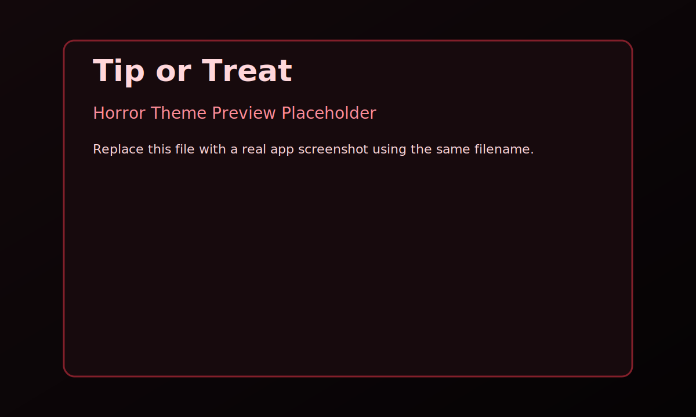
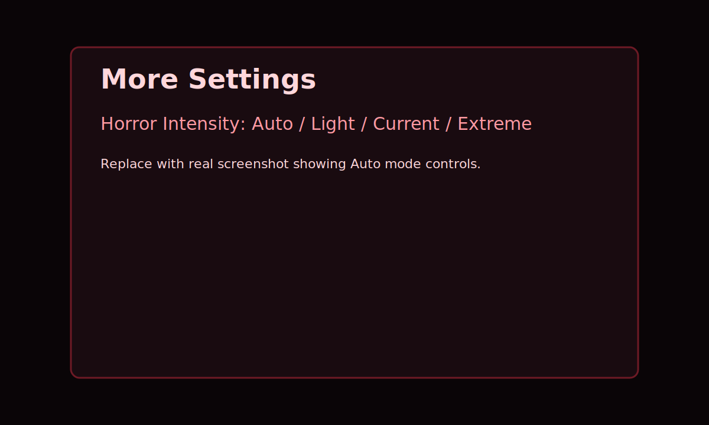
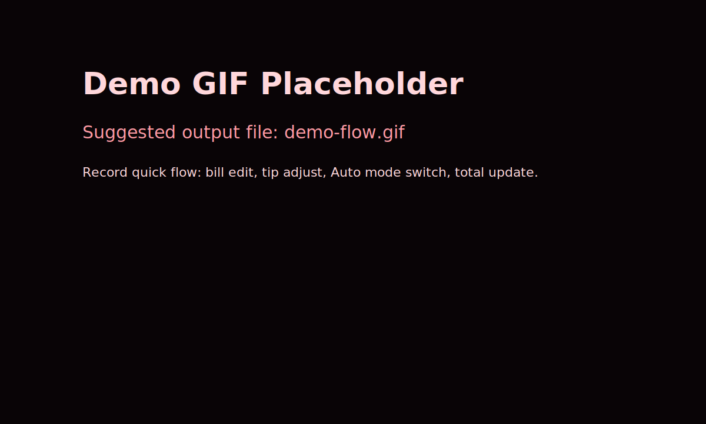

# Tip or Treat

Compact, mobile-first tip calculator with a Halloween/horror visual style, offline PWA support, and Android APK packaging.

Built with plain HTML, CSS, and JavaScript.

## Features

- Tip by percent or by amount (both stay synced)
- Before-tax and after-tax tip modes
- Quick plus/minus controls for bill, tip percent, tip amount, and total rounding
- Per-person split calculation
- Calculator sheet for numeric entry on all fields
- Persistent local state
- Installable PWA (manifest + service worker)
- Horror theme with atmospheric effects

## Screenshots and Demo

Home screen (horror mode):



Settings and Auto intensity:



Demo flow preview:



Media notes:

- See docs/media/README.md for recommended real screenshot and GIF filenames.
- Replace the SVG placeholders with your real captures before publishing if you want a fully polished repo front page.

## What Was Updated Today

### Visual redesign (Halloween to horror)

- Re-themed app from neutral colors to dark horror palette
- Added haunted app container styling, stronger contrast, and low-light readability tuning
- Added coffin-inspired button silhouettes for primary controls
- Added atmospheric texture, subtle fog, and glow accents

### Horror intensity system

- Added intensity levels: Light, Current, Extreme
- Added Auto mode that changes by local time:
	- 06:00-15:59 -> Light
	- 16:00-20:59 -> Current
	- 21:00-05:59 -> Extreme
- Added hourly auto-refresh while app is open
- Saved intensity preference in local storage

### Motion and accessibility

- Added title flicker animation
- Added drifting fog layer
- Added reduced-motion handling via prefers-reduced-motion

### Emoji rendering fix

- Title emojis now render in native full color
- Distressed text effect is applied only to title text, not emoji glyphs

### PWA/theme updates

- Updated theme color and status bar styling for dark mode/bar usage
- Updated manifest colors and icon background tones
- Bumped service worker cache version to refresh themed assets

### Android packaging

- Built fresh debug APK successfully
- Fixed Android SDK path in android-app/local.properties
- Produced installable APK at project root

## Run as a Web App

Open tip-or-treat.html in a modern browser.

## PWA Install

1. Open the app in Chrome, Edge, or Safari
2. Use Add to Home Screen / Install App
3. Launch offline like a native app

## Android APK

Primary install file:

- tip-or-treat-install.apk

Build output file:

- android-app/app/build/outputs/apk/debug/app-debug.apk

Build command used:

```powershell
& 'C:\Users\ethan.allen\.gradle\wrapper\dists\gradle-8.13-bin\5xuhj0ry160q40clulazy9h7d\gradle-8.13\bin\gradle.bat' --project-dir 'C:\webapp\app\tip-or-treat\android-app' clean assembleDebug
```

## Project Structure

```text
tip-or-treat/
|- tip-or-treat.html
|- manifest.json
|- sw.js
|- tip-or-treat-install.apk
|- README.md
|- docs/media/
|  |- home-horror.svg
|  |- settings-auto.svg
|  |- demo-flow.svg
|  `- README.md
`- android-app/
	 `- app/build/outputs/apk/debug/app-debug.apk
```

## License

Free to use and modify.
